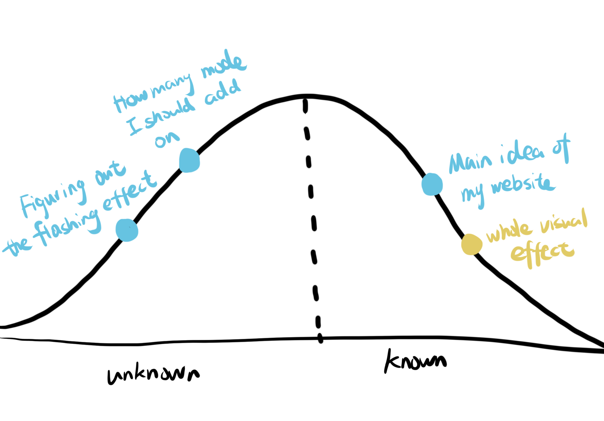

## Project 4 
> Input and Output

---------------------

* Introduction
* Image of hill chart
* description of hill chart

## Introduction
For project 4, I will make a disco party light generator. People can use their computer and phone to create a party atmosphere at home. Once people enter my home page, they can choose multiple colors to flashing. Then, after clicking start, you can also change the speed. There is also a sunset mode in the left top corner, you can stop the flashing, enjoyning some peaceful time.

## Hill chart

There are mainly two problems for me to solve, one is figuring out how to make the flashing effect come true. The other one is how many mode should I add on. But the whole visual effect and the main idea was aleady set up.

